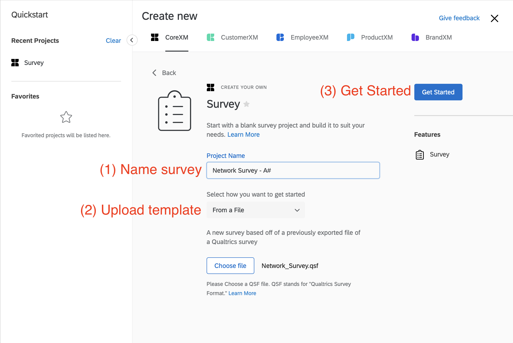
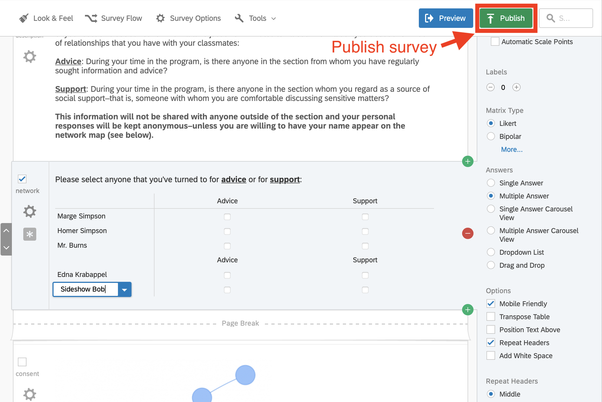

# Class Network Survey

This package supports a class social network exercise through a Qualtrics survey
file and an online visualization dashboard. The dashboard also generates
individualized network reports. The latest version of the dashboard is available
at https://balachia.shinyapps.io/ob2-survey.

There are a few steps to get the network survey set up:

1) [Survey setup](#survey-setup)
    1) [Set up panel file](#set-up-panel-file)
    2) [Set up Qualtrics panel](#set-up-panel-file)
    3) [Set up Qualtrics survey](#set-up-qualtrics-survey)
    4) [Distribute survey](#distribute-survey)
    5) [Download data](#download-data)
2) [Survey dashboard](#survey-dashboard)
3) [Individual reports](#individual-reports)

## Template files

Before starting, download the [network survey
files](https://github.com/balachia/class-survey/releases/latest) 
containing various templates for setting up the survey. The `survey` folder
contains templates, and the `sample` folder contains sample results for the
Zachary Karate Club network.

## Survey setup

### 1) Set up panel file

First, you must create the email list/network roster for the survey. Open
`survey/panel_template.xlsx` and fill it in with the class details:

- `FirstName` / `LastName`: Self-explanatory, needed only to refer to the
student.
- `Email`: Critical, needed to distribute the survey and reports
- `FullName`: Critical, needed for students to identify each other in the roster
- `NodeID`: Critical, needed for the dashboard to link network
respondents/respondees

Students can be listed in any order (alphabetical, by section, etc.). *BUT, be
sure that NodeID is sorted 1, 2, ..., else the dashboard will not correctly link
students.*

Save this panel as a `.csv` file (e.g. `section-aX-panel.csv`) for uploading to
Qualtrics.

### 2) Set up Qualtrics panel

In your Qualtrics account, create a new contact list (Contacts > Create Contact
List). Give it a meaningful name (e.g. "Panel A#"). Finally, upload the file
from the last step (`section-aX-panel.csv`).

Verify that the preview contains the `NodeID`, `Email`, and `FullName` fields.

### 3) Set up Qualtrics survey

In your Qualtrics account, use the survey template (`survey/Network_Survey.qsf`)
to create a new survey (Projects > Create New Project > Survey > From File).

Upload the survey template file, then rename the survey to something meaningful
(e.g. "Network Survey - Section A#"). Finally, click "Get Started" to create the
survey.

In the survey, fill in the network roster. Return to your panel file
(`section-aX-panel`) and *COPY* all names from the `FullName` column. In the
survey, find the question called (`network`), select the default text ("Click to
write Statement 1"), then *PASTE* the list into this field.

This will fill in the network roster. Click out of the text entry field, and
make sure that the list of students looks correct. Finally, click *"Publish"* to
finalize and save the survey.

*Notes*:

- Feel free to edit the text of the survey, *BUT*: make sure that the network
roster question is titled `network` and the anonymization consent question is
titled `consent`.
- If the `NodeID` column is sorted 1, 2, ... in the same order as the `FullName`
column pasted into the survey, the dashboard can link responders to respondees
in the survey output.

### 4) Distribute survey

When you're ready, distribute the survey over email.

From the survey page, create an email distribution (Distributions > Distribute
Survey > Email > Compose Email).

Select the panel you've created (My Library > "Panel A#" > Select Entire Contact
List). Set up the email and subject---check that it looks correct by sending
yourself a preview email. Fill in the sending time, then click "Send" to send
out the email.

You can also schedule reminder emails to those that have not completed the
survey.

### 5) Download data

Once the survey is completed, download the data.

From the survey page, download the data as a CSV (Data & Analysis > Export &
Import > Export Data > CSV). Check off "Download all fields" and "Use choice
text", then click "Download" to download the data.

At this point, you should be ready to display the network data.

## Survey dashboard

There are several ways to set up and use the network dashboard. The easiest is
to use the version available at https://balachia.shinyapps.io/ob2-survey. You
preview the dashboard by using sample results mimicking the Zachary Karate Club
Network (`sample/ZKC Qualtrics.zip`).

### Upload the survey data

Upload the survey results file (Upload Qualtrics file). The network will display
as soon as it finished loading. If there is an error or the screen turns gray,
please let me know, as there is probably some kind of bug.

### Select the network to display

Select whether the dashboard should display the "Advice" or the "Support"
network (Select network). Then select which tie direction to display (Select
network direction): directed ties, mutual ties (both respondents selected each
other), or any ties (either responded selected the other). In the directed
network, mutual ties are thick, while one-directional ties are thin.

You may use this to select the network that looks cleanest and least dense.

### Highlight centrality

Highlight node centrality on various metrics (Color by). In each case, darker
nodes have a higher score (i.e. the darkest nodes have the highest eigenvector
score, betweenness score, etc.).

- *Out-degree*: the number of people that ego selected. "Self-perceived
popularity"
- *In-degree*: the number of people that selected the ego. "True popularity"
- *Closeness*: the average distance of ego to all others. "Personal Kevin Bacon
score"
- *Betweenness*: how often paths between individuals must pass through ego.
"Network control ability"
- "Eigenvector": how connected ego is to other well-connected people.
"Influence/status"
- "Cluster": what fraction of ego's ties are mutually connected. "Local community"

### Reveal names

You can also highlight the names of individual respondents that have consented
to have their names revealed.

First, select "Highlight consenters" to highlight the nodes whose names are
available: consenters are large, while non-consenters become small. Then, select
"Reveal names" to be able to reveal individual names. When you click on a node,
its name will appear below it. Anonymous respondents will display "???".

### Exports

If you would like to present the networks offline, you can export any view of
the network by clicking "Export as png" in the bottom right of the map.

You can also download the network data to analyze offline in other softare
(Download network data > Download).

### Sample sequence

You might start by briefly discussing the features of the network, such as any
apparent clusters or bridges. Then you step through various measures of
centrality, and contrast e.g. out-degree with in-degree popularity, or show how
popular respondents may not be the most central on closeness or betweenness
metrics. Finally, you might move to highlight individual respondents, and ask
the class to guess their identity or discuss whether their position matches
prior guesses.

## Individual reports

The dashboard can also generate individualized reports for every node in the
network (Generate reports > Download). Wait for this process to complete; once
it is done, you can download all the reports as a zip file. See `sample/ZKC
Reports.zip` for a sample reflecting the Zachary Karate Club network.

The reports are anonymized and show the student's position in the advice and
support networks, as well as their percentile scores on various centrality
measures.

Reports are named by their NodeID. It should be possible to distribute these
reports through some kind of mail merge. I have not yet set up a pipeline for
this.
